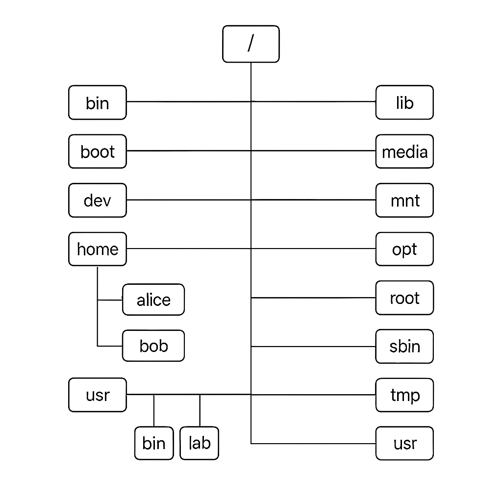

# 📁 Understanding File Systems & the Unix-like Directory Structure

## What Is a File System?

A **file system** is a critical component of an operating system (OS) that defines how data is stored, accessed, and organized on a storage medium such as a hard disk, SSD, or USB drive.

A file system:
- Assigns names to files and organizes them into directories (folders).
- Keeps track of where data is physically located on the disk.
- Manages permissions and access control.
- Provides mechanisms for reading, writing, and executing files.

---

## 📂 Types of File Systems

Some commonly used file systems include:
- **NTFS** (Windows)
- **FAT32 / exFAT** (cross-platform support)
- **ext4** (Linux)
- **HFS+ / APFS** (macOS)
- **ZFS, Btrfs, XFS** (advanced Unix/Linux systems)

---

## 🐧 Unix-like File System Overview

Unix-like systems (such as Linux and macOS) use a **hierarchical file system**, beginning with a single root directory: `/`.

All other files and directories exist under this root, regardless of which physical storage device they're on. This design enables:
- Easy mounting of additional devices into the file system tree.
- Logical and predictable directory structure.
- Separation of user data, system files, and third-party applications.

---

## 🌳 File System Diagram

> _Figure: High-level view of the Unix-like file system hierarchy._

---

## 🗂️ Key Directories and Their Purposes

| Directory | Purpose |
|----------|---------|
| `/`      | The root directory (top of the hierarchy). |
| `/bin`   | Essential user command binaries (e.g., `ls`, `cp`, `mv`). |
| `/sbin`  | Essential system binaries (used by the system admin). |
| `/etc`   | Configuration files for the system and installed software. |
| `/dev`   | Device files representing hardware (e.g., `/dev/sda`). |
| `/proc`  | Virtual filesystem for system and process info. |
| `/sys`   | Virtual filesystem providing information about devices. |
| `/tmp`   | Temporary files (often cleared on reboot). |
| `/var`   | Variable data such as logs, mail, and spool directories. |
| `/home`  | User directories (e.g., `/home/alice`). |
| `/root`  | Home directory of the root (admin) user. |
| `/lib`   | Shared system libraries needed by `/bin` and `/sbin`. |
| `/usr`   | Secondary hierarchy for read-only user data. |
| `/opt`   | Optional third-party software and add-on packages. |
| `/media` | Mount point for removable media (USB drives, CDs). |
| `/mnt`   | Temporary mount point used by system admin. |
| `/run`   | Runtime variable data (information about the running system). |

---

## 🧠 Important Concepts in Unix File Systems

### 🔗 Everything is a File
In Unix, almost everything is treated as a file — including hardware devices, directories, and processes.

### 🔐 File Permissions
Each file has three types of permissions:
- **Read (r)**
- **Write (w)**
- **Execute (x)**

These are assigned to three categories:
- **User (owner)**
- **Group**
- **Others**

Example: `-rwxr-xr--`

### 🔧 Mounting
A mounted file system appears as a subdirectory of the existing tree. For example, a USB drive might be mounted at `/media/usb`.

---

## 📚 References

- [Filesystem Hierarchy Standard (FHS)](https://refspecs.linuxfoundation.org/FHS_3.0/fhs/index.html)
- [Linux File System Guide](https://tldp.org/LDP/Linux-Filesystem-Hierarchy/html/index.html)

---
